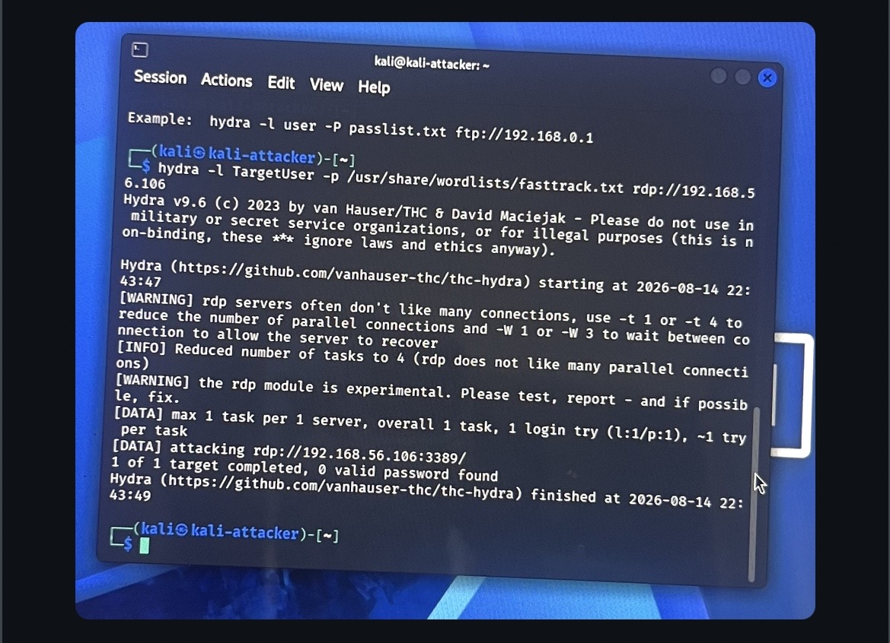
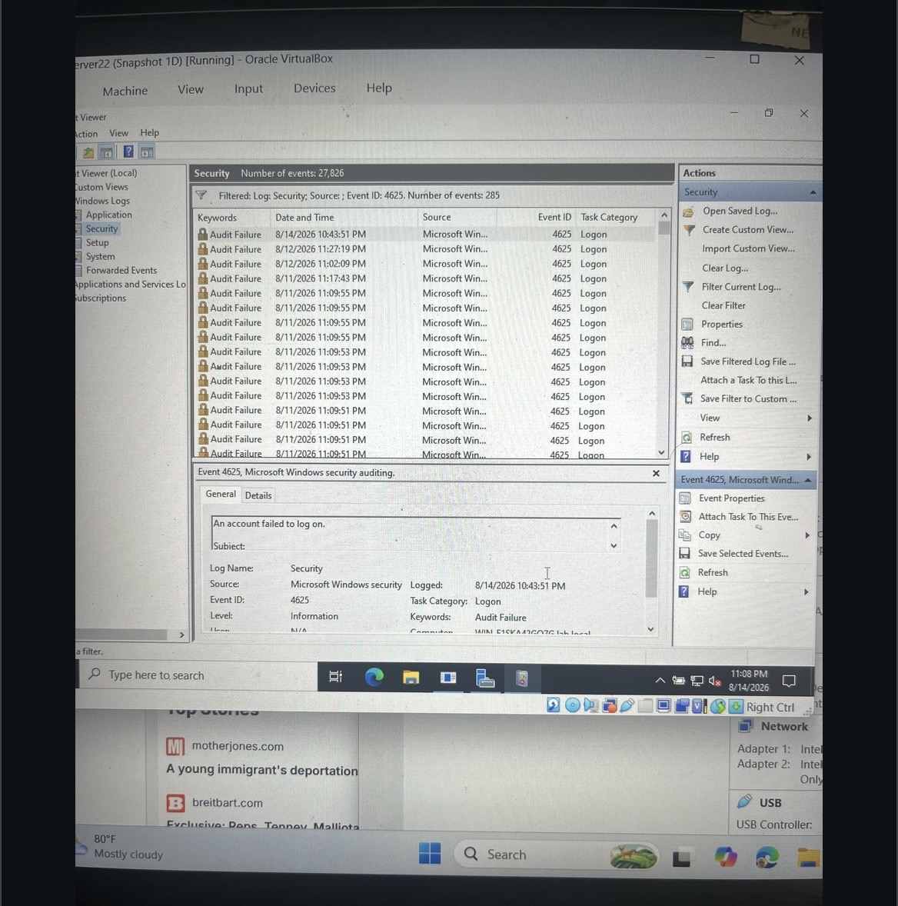
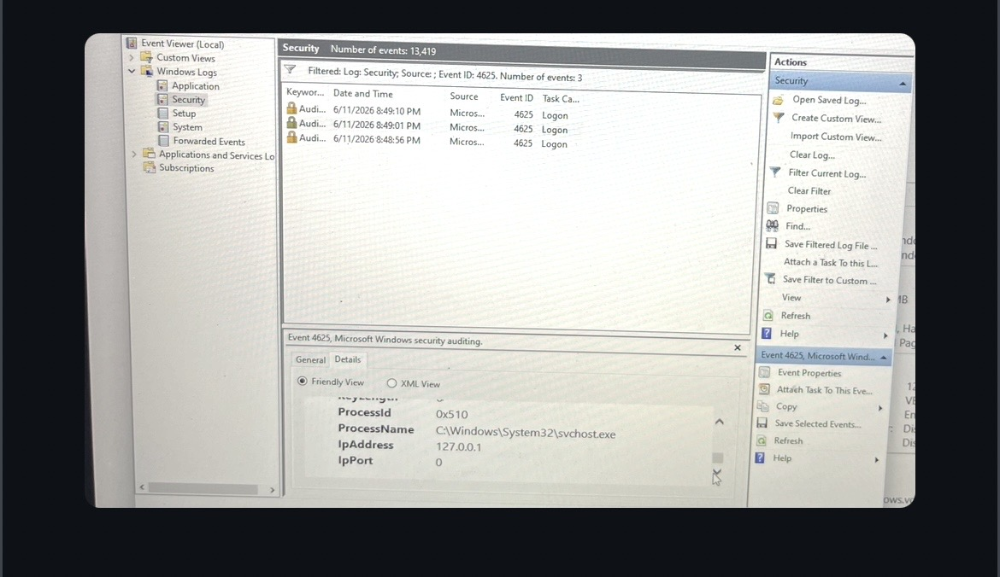
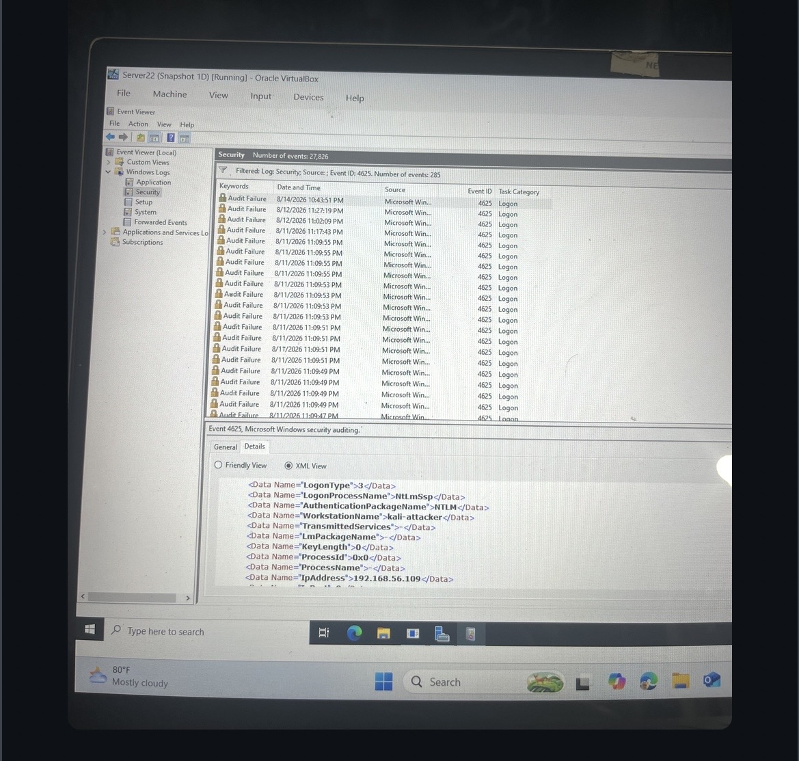
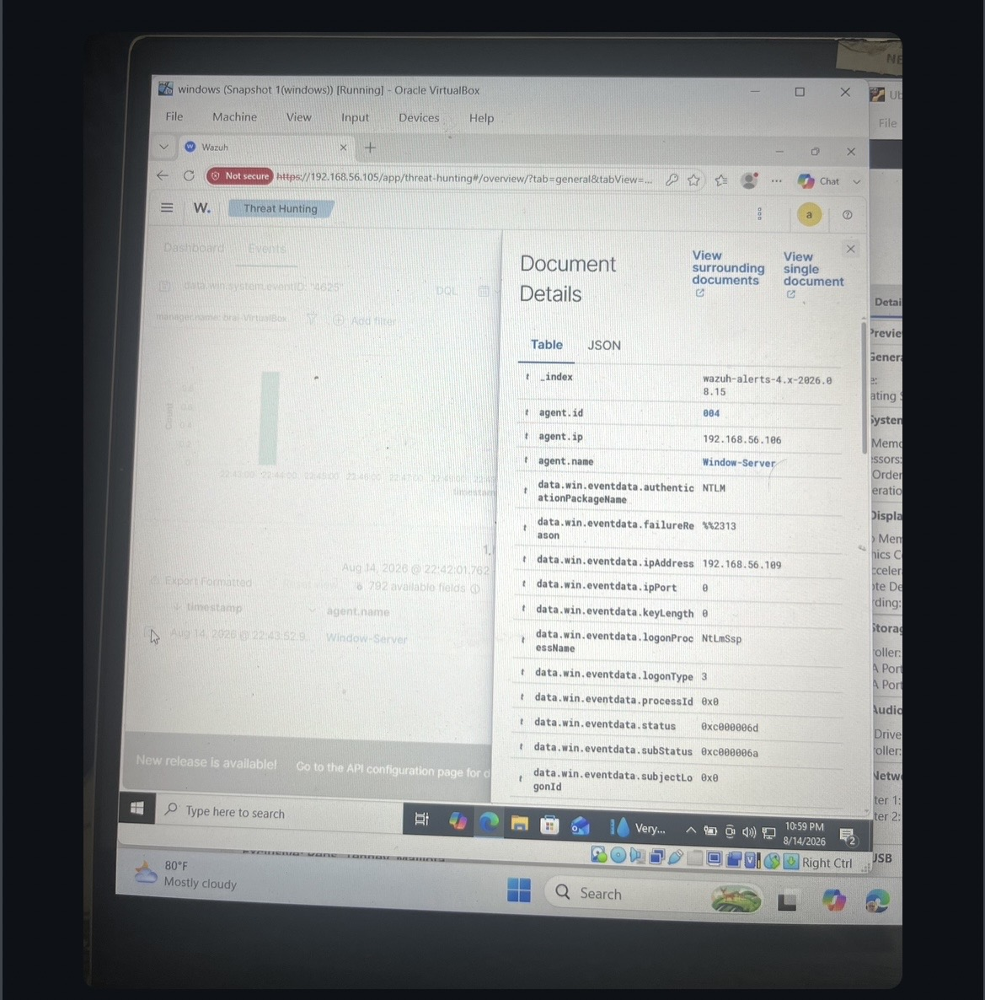

# Project 1: Active Directory Password Spray & Wazuh Investigation

## Overview

This project documents a controlled RDP password-guessing simulation from Kali Linux against a Windows workstation in an isolated VirtualBox lab. The investigation followed the activity from the authentication attempt to Windows Event ID 4625 and Wazuh SIEM telemetry.

The investigation also included correcting an initial network-source attribution issue so the Windows security event correctly identified the Kali system as the remote source.

---

## Lab Environment

| Component      | Configuration       |
| -------------- | ------------------- |
| Attacker       | Kali Linux          |
| Attacker IP    | `192.168.56.109`    |
| Target         | Windows Workstation |
| Target IP      | `192.168.56.106`    |
| Protocol       | RDP                 |
| Port           | `3389`              |
| Account        | `TargetUser`        |
| Attack Tool    | Hydra v9.6          |
| SIEM           | Wazuh               |
| Virtualization | VirtualBox          |

---

## 1. Authentication Attack Simulation

A controlled RDP authentication test was performed from Kali Linux against the Windows workstation using Hydra.

The primary test targeted:

* **Target:** `192.168.56.106`
* **Port:** `3389`
* **Protocol:** RDP
* **Account:** `TargetUser`

The test completed without discovering a valid password.

### Evidence

**Hydra RDP Attack**

---

## 2. Windows Event ID 4625 Investigation

Windows Event Viewer recorded the failed authentication activity as **Event ID 4625 — An account failed to log on**.

The Security log contained multiple failed-logon events, providing the Windows-side evidence for the investigation.

### Event Details

* **Event ID:** `4625`
* **Task Category:** Logon
* **Result:** Audit Failure
* **Log:** Security

### Evidence

**Event ID 4625 Event History**

---

## 3. Source IP Attribution Investigation

The initial Windows event showed the authentication source as `127.0.0.1`.

The VirtualBox network configuration was then corrected so the Windows security telemetry could properly identify the remote source.

After the correction, the Event ID 4625 data identified the Kali system as:

* **Source IP:** `192.168.56.109`
* **Workstation:** `kali-attacker`

This established the connection between the failed authentication events and the Kali system performing the controlled test.

### Initial Source

### Corrected Source

---

## 4. Authentication Analysis

The corrected Event ID 4625 event contained the following authentication information:

| Field                  | Value            |
| ---------------------- | ---------------- |
| Event ID               | `4625`           |
| Logon Type             | `3`              |
| Logon Process          | `NtLmSsp`        |
| Authentication Package | `NTLM`           |
| Workstation            | `kali-attacker`  |
| Source IP              | `192.168.56.109` |
| Result                 | Audit Failure    |

The event confirmed that the failed authentication activity was associated with the remote Kali system rather than being generated locally by the Windows workstation.

---

## 5. Wazuh SIEM Validation

The Windows security telemetry was collected by the Wazuh agent and processed by the Wazuh manager.

Wazuh document details provided additional authentication fields that allowed the Windows event to be correlated with the controlled attack activity.

### Evidence

**Wazuh Forensic Event Details**

---

## Investigation Result

The investigation successfully demonstrated the full attack-to-telemetry workflow:

1. A controlled RDP authentication test was performed from Kali Linux.
2. Windows recorded the failed authentication as Event ID 4625.
3. The initial source attribution was identified as `127.0.0.1`.
4. The VirtualBox network configuration was corrected.
5. Windows subsequently identified Kali as `192.168.56.109`.
6. Wazuh collected and processed the Windows security telemetry.
7. The authentication details were validated through Wazuh document data.

This demonstrates the ability to correlate authentication activity across the attacker, Windows endpoint, and SIEM layers.

---

## Skills Demonstrated

* Windows Event ID 4625 Analysis
* Authentication Attack Simulation
* RDP Security Monitoring
* NTLM Authentication Analysis
* Source IP Attribution
* Windows Security Event Investigation
* Network Configuration Troubleshooting
* Wazuh SIEM
* Attack-to-Telemetry Correlation
* Security Investigation Documentation

